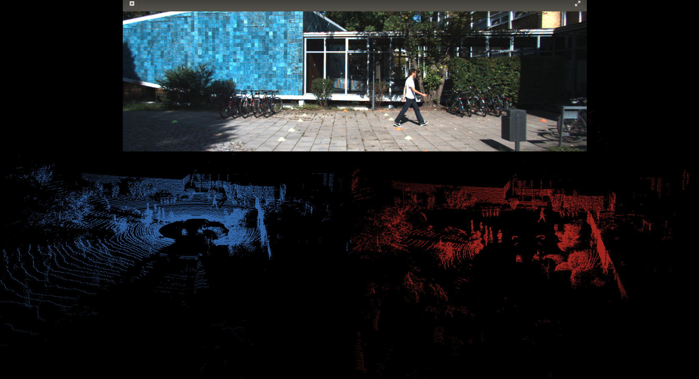
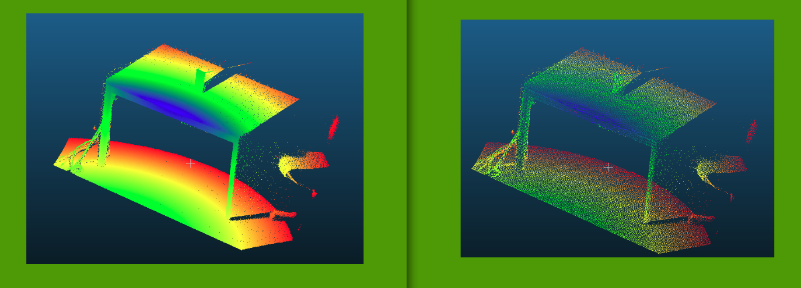

## enviroment
```
ubuntu 16.04
pcl 1.7
```
## usage
```
mkdir build
cd build
cmake ..
make
cd ..
./pcl_test
```
You can use `pcl_viewer` tool to visualize the result: `pcl_viewer pointcloud_files/000000_filtered.pcd`.    

Comparison before & after filtering ground(point cloud file is from kitti dataset):  


use `./voxel_gird`, and you can have:
